## <u> Calculette_Unitaire </u>
***
1. Démarrer le projet CALCULETTE_UNITAIRE dans GITHUB et le cloner dans VSCode.  
>
2. Créer l'arborescence selon l'énoncé de l'exercice, en ajoutant les données fournies.  
>
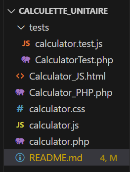  
>  
3. Dans <b>Bash</b>, procéder à l'installation ou MAJ des fichiers fonctionnels.    
  

   *  **Installer Composer** (json, lock, vendor) :
>
> composer require --dev phpunit/phpunit  
>
> 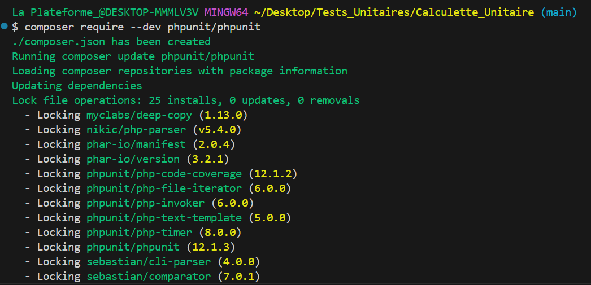  
>
>
>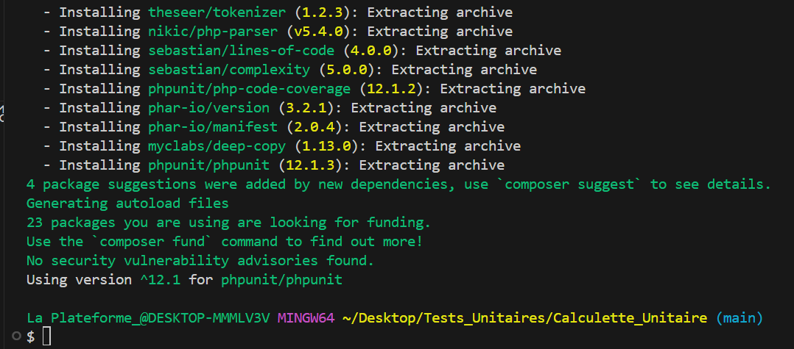  
>

* * **Installer Node.js** (pour installer le Package.json) :  
  
>npm init -y  
>
> 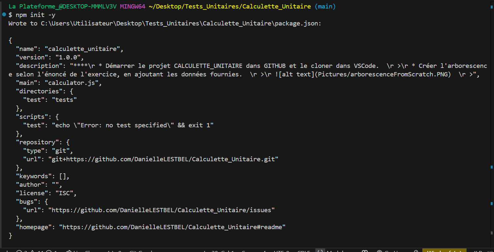   

4. **Création** des fichiers **CalculatorTest.php** et  **calculator.test.js** 
>  
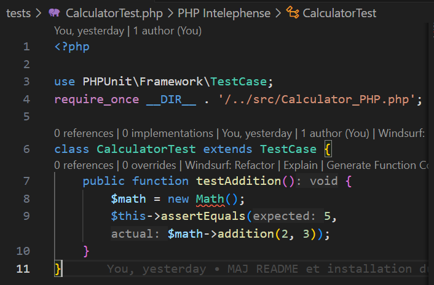  

#### Avant de lancer les tests unitaires :  
1. **Installer jest.config.js**
>*Commande* : npx jest --init    
>
>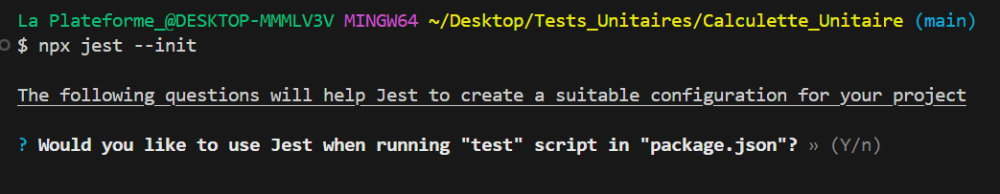  
>
>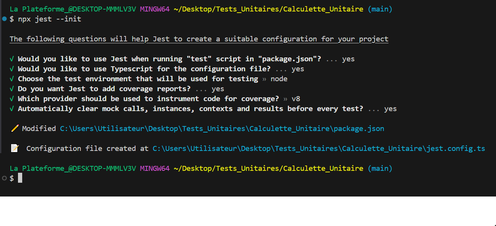

Puis, 
>*Commande* : npx install jest --global     
>
>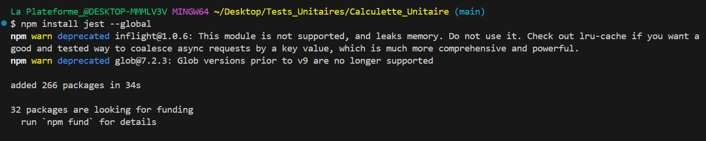

#### Lancement du test sur la Calculette JS :    

>*Commande* : npx jest tests/calculator.test.js    
>
> 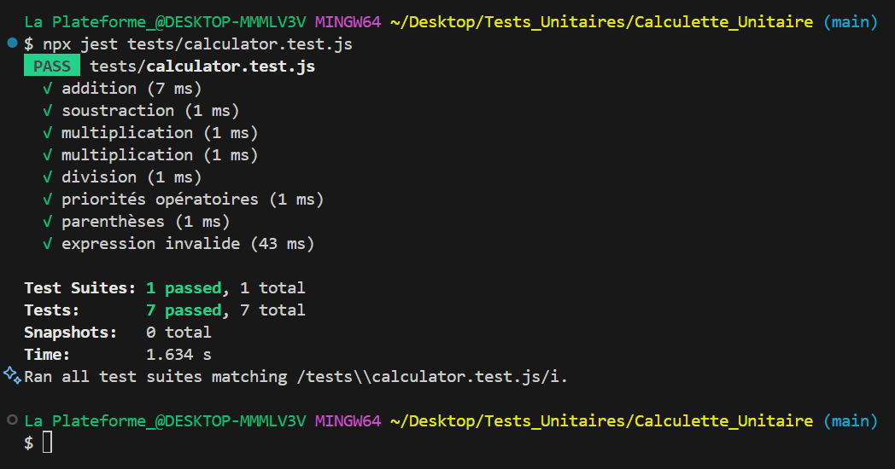  

>La calculette :  
>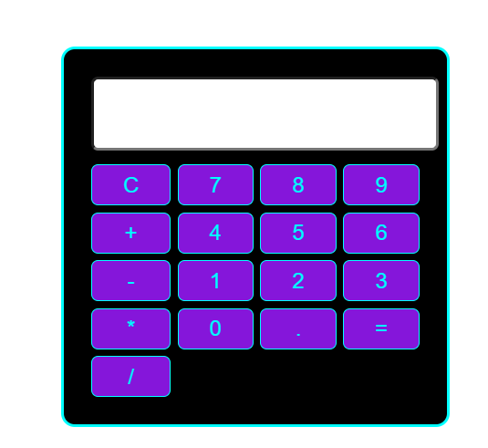    

>Addition :  
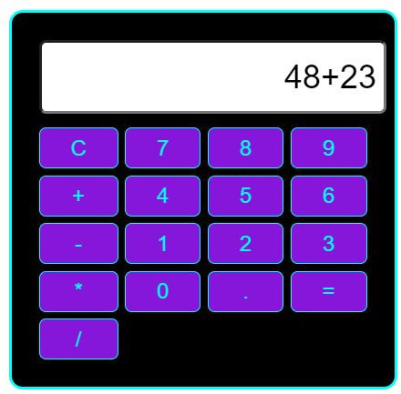
>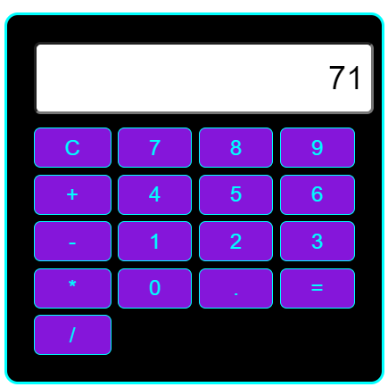   

>Soustraction :    
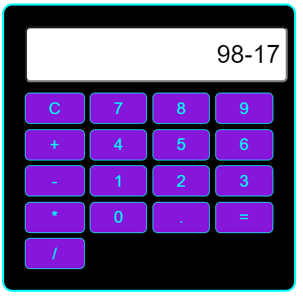
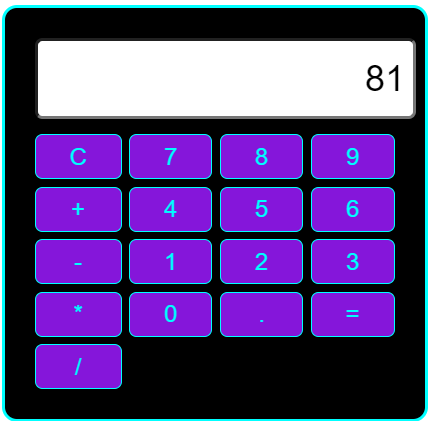    

>Multiplication :     
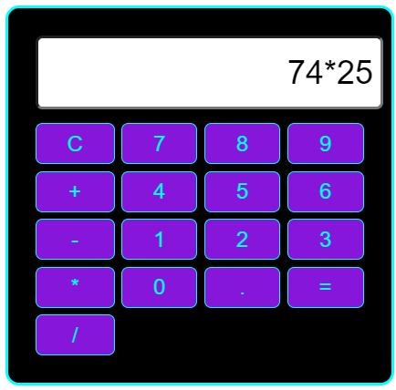
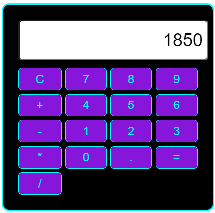     
>     
>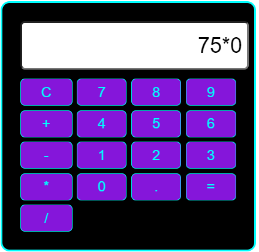
>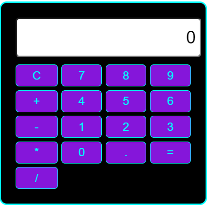     

>Division : 
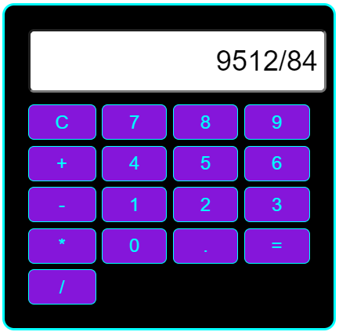
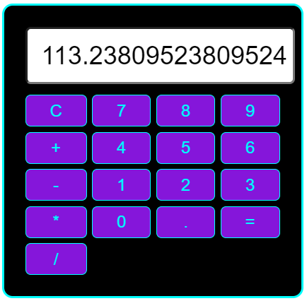     
>      
>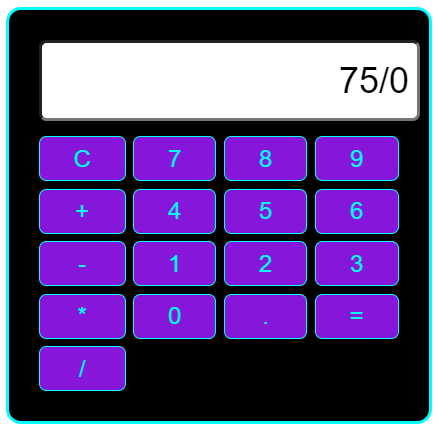
>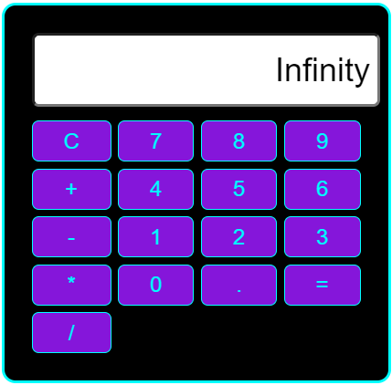

>Priorisation des calculs :     
2+3x4 => 14 (la priorisation est la multiplication [3x4] puis l'addition [12+2])     
>      
>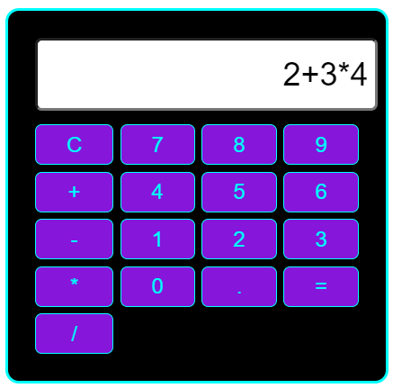
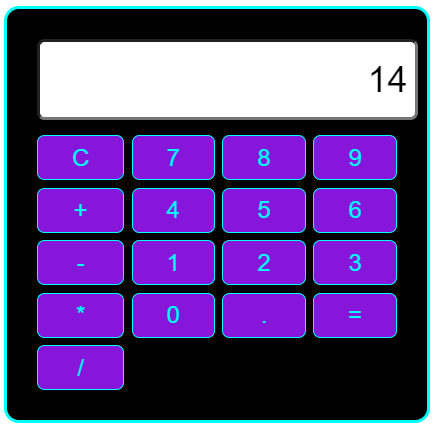             

Parenthèses dans les calculs :     
 

